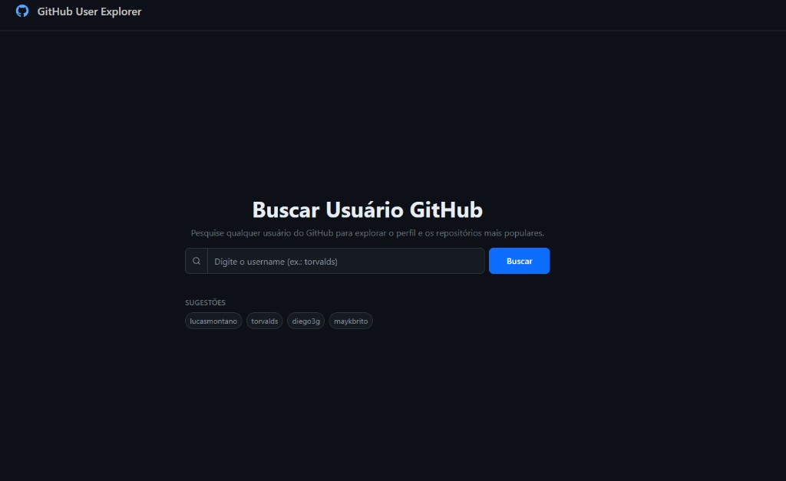
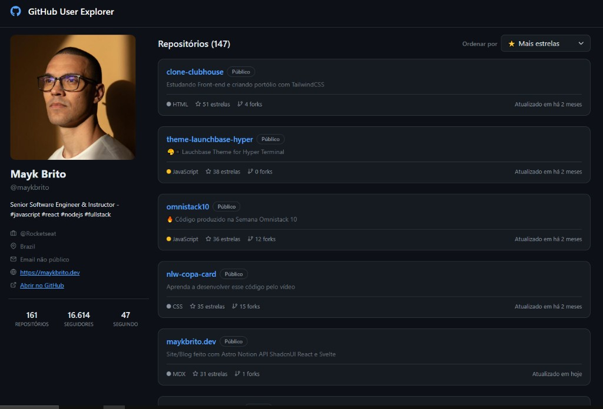
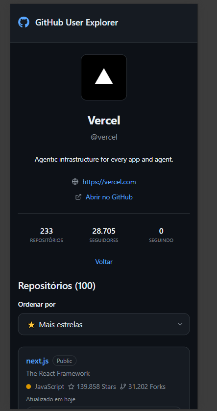
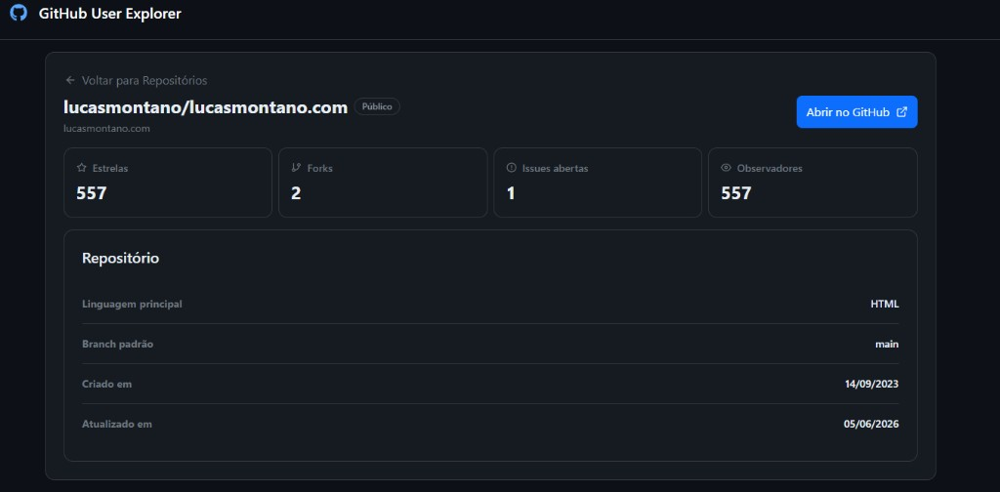
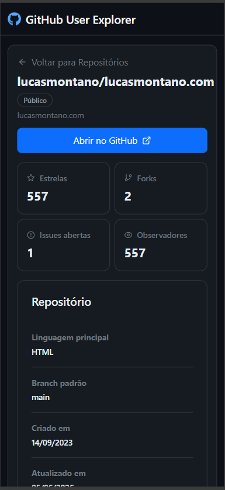

# GitHub User Explorer

Aplicação client-side para buscar usuários do GitHub, exibir detalhes do perfil, listar repositórios com ordenação e paginação, e mostrar detalhes de cada repositório.

**Demo em produção:** [https://desafio-github-search.vercel.app/](https://desafio-github-search.vercel.app/)

## Como usar

1. Acesse a [demo](https://desafio-github-search.vercel.app/) ou rode localmente (`npm install`, `cp .env.example .env`, `npm run dev`).
2. Na home, digite um username (ex.: `torvalds`) ou clique em uma sugestão e pressione **Buscar**.
3. Na página do usuário, confira o perfil à esquerda (desktop) ou no topo (mobile) e a lista de repositórios.
4. Use **Ordenar por** para alternar entre **Mais estrelas** (`sort=stars-desc`, padrão) e **Menos estrelas** (`sort=stars-asc`).
5. Navegue entre páginas com os controles de paginação (10 repositórios por página).
6. Clique em um repositório para ver os detalhes; use **Abrir no GitHub** para abrir a página oficial.
7. Teste um username inválido (ex.: `<>`) ou inexistente (ex.: `usuario-que-nao-existe-123`) — o erro aparece na própria tela de busca, sem trocar de página.

## Screenshots

### Busca


### Perfil do usuário
| Desktop | Mobile |
|---------|--------|
|  |  |

### Detalhes do repositório
| Desktop | Mobile |
|---------|--------|
|  |  |

## Funcionalidades

- **Busca de usuários** — validação com Zod + React Hook Form; verificação na API antes de navegar; sugestões rápidas (`lucasmontano`, `torvalds`, `diego3g`, `maykbrito`)
- **Perfil do usuário** — avatar, bio, email (ou fallback "Email não público"), site, link externo para o GitHub, contadores de repositórios, seguidores e seguindo
- **Listagem de repositórios** — cards com linguagem, estrelas, forks e data de atualização; paginação de 10 por página
- **Ordenação por estrelas** — mais estrelas (padrão) ou menos estrelas via GitHub Search API
- **Detalhes do repositório** — metadados completos e botão "Abrir no GitHub"
- **Estados de UI** — skeletons com animação shimmer (perfil, repositórios e detalhe), erros inline na busca, usuário não encontrado (404) na `UserPage`
- **Layout responsivo** — mobile-first; inputs com `font-size` ≥ 16px para evitar zoom automático no iOS Safari
- **Cache de dados** — TanStack Query evita re-fetch desnecessário ao navegar entre páginas

## Stack

- React 19 + TypeScript
- Vite
- Bootstrap 5 + React-Bootstrap
- React Hook Form + Zod
- React Router DOM
- TanStack Query v5
- Axios
- React Icons
- Vitest + Testing Library

## Instalação

```bash
npm install
cp .env.example .env
```

### Variáveis de ambiente (opcional)

| Variável | Descrição | Padrão |
|----------|-----------|--------|
| `VITE_API_URL` | URL base da API do GitHub | `https://api.github.com` |
| `VITE_GITHUB_TOKEN` | Token pessoal para aumentar rate limit | _(vazio)_ |

Sem token, a Search API permite ~10 requisições/minuto (erro 403). Com token autenticado, o limite sobe significativamente. Crie um token em [GitHub Settings → Tokens](https://github.com/settings/tokens) (escopo público, sem permissões extras).

## Desenvolvimento

```bash
npm run dev
```

Abra [http://localhost:3000](http://localhost:3000).

## Build

```bash
npm run build
```

## Preview (build local)

```bash
npm run preview
```

## Deploy (Vercel)

O projeto inclui [`vercel.json`](vercel.json) com rewrite SPA — todas as rotas (`/user/:username`, `/repository/:owner/:repo`, etc.) são redirecionadas para `index.html`, permitindo refresh e links diretos na demo publicada.

Após o deploy, valide URLs como `/user/torvalds` e `/repository/torvalds/linux` diretamente no navegador.

## Lint

```bash
npm run lint
```

## Testes

```bash
npm run test
npm run test:coverage
```

O projeto possui **18 arquivos de teste** (83 testes), cobrindo:

- **Hooks:** `useGithubUser`, `useRepositories`, `useSearchForm`
- **Services:** `getUserRepositoriesPage`, `getUserRepositories`, `searchUserRepositories`
- **Utils:** `sortRepositories`, `paginateRepositories`, `format`, `parsePageParam`, `parseSortParam`
- **Schemas:** `search.schema` (validação Zod do username)
- **Páginas:** `UserPage`, `RepositoryPage`
- **Componentes:** `SearchForm`, `UserProfile`, `RepositoryCard`, `RepositoryHeader`, `RepositoryList`, `RepositoryPagination`, `RepositorySortSelect`

**Cobertura (`npm run test:coverage`):** o relatório mede os módulos-fonte cobertos pelos testes acima — hooks, services, utils, componentes testados, `UserPage` e `shared/lib` (conforme `vite.config.ts`).

## Rotas

| Rota | Descrição |
|------|-----------|
| `/` | Página de busca |
| `/user/:username` | Perfil do usuário e repositórios |
| `/repository/:owner/:repo` | Detalhes do repositório |

### Query params (`/user/:username`)

| Param | Valores | Padrão | Descrição |
|-------|---------|--------|-----------|
| `page` | inteiro ≥ 1 | `1` | Página atual da listagem |
| `sort` | `stars-desc`, `stars-asc` | `stars-desc` | Ordenação por estrelas (mais/menos) |

Exemplo: `/user/torvalds?page=2&sort=stars-asc`

## API

Utiliza a API REST pública do GitHub. Token opcional via `VITE_GITHUB_TOKEN` (ver [Variáveis de ambiente](#variáveis-de-ambiente-opcional)).

| Endpoint | Uso |
|----------|-----|
| `GET /users/{username}` | Dados do perfil e validação na busca (antes de navegar) |
| `GET /search/repositories?q=user:{username}&sort=stars&order={desc\|asc}&per_page=10&page={n}` | **Fluxo principal** — lista paginada de repositórios ordenados por estrelas |
| `GET /users/{username}/repos?per_page=100&page={n}` | **Fallback** — quando a Search API retorna 403 (rate limit); busca todos os repos, ordena e pagina no client |
| `GET /repos/{owner}/{repo}` | Detalhes do repositório |

Headers enviados: `Accept: application/vnd.github+json` e `Authorization: Bearer {token}` quando configurado.

## Arquitetura

Projeto organizado por features em `src/features/`:

```
src/
├── app/              # router, layouts, loaders, providers, error boundary
├── features/
│   ├── search/       # busca (RHF + Zod, search.schema, useSearchForm)
│   ├── github-user/  # perfil, useGithubUser, useUserPageParams e parsers de URL
│   └── repositories/ # listagem, paginação, detalhes e hook useRepositories
└── shared/           # api, config, ui, lib, styles
```

- **TanStack Query** — cache de 5 min; `queryKey` `["user", username]` para perfil e `["repositories", username, page, sort]` para repositórios
- **Hooks** (`useGithubUser`, `useRepositories`) — consomem services Axios via `useQuery`
- **Estado na URL** — `useUserPageParams` sincroniza `page` e `sort` na rota do usuário; query params são resetados ao trocar de username
- **Loader** (`repositoryLoader`) — pré-carrega dados na rota de detalhes do repositório
- **Barrel exports** (`index.ts`) em cada feature — evitar deep imports
- **Design tokens** — tema escuro via `data-bs-theme="dark"` e variáveis CSS em `src/shared/styles/index.css`
- **Componentes UI** — wrappers finos em `shared/ui` sobre React-Bootstrap mantendo API estável

## Decisões técnicas

### Bootstrap + tema escuro

O edital cita Bootstrap como referência de **layout responsivo**. A UI usa React-Bootstrap com:

- Grid responsivo (`Row`/`Col`), `Navbar`, `Form`, `Card`, skeleton customizado (`.skeleton`)
- Tema escuro via `data-bs-theme="dark"` e override de variáveis (`--bs-body-bg`, `--bs-primary`, etc.)
- Wrappers em `shared/ui` para não acoplar features ao Bootstrap diretamente

### Busca — React Hook Form + Zod

- Schema central em `src/features/search/schemas/search.schema.ts` (regex GitHub, mensagens curtas)
- `useSearchForm` valida no submit e consulta `GET /users/{username}` antes de navegar
- Erros de formato, 404 e API exibidos inline no campo (Bootstrap Validation), sem layout shift
- Loading no botão **Buscar** via `isSubmitting` ("Buscando...")

### Search API + fallback `/users/repos`

A listagem usa `GET /search/repositories` como fluxo principal (paginação server-side, ordenação por estrelas), alinhado ao padrão de referência do desafio.

Quando a Search API retorna **403** (rate limit sem token), o service `getUserRepositoriesPage` faz fallback automático para `GET /users/{username}/repos` (endpoint do edital), busca todas as páginas (100 por request), ordena com `sortRepositories` e pagina com `paginateRepositories` no client.

Limitações: Search API retorna no máximo 1000 resultados; rate limit de 10 req/min sem autenticação. Configure `VITE_GITHUB_TOKEN` para evitar bloqueios. TanStack Query mitiga re-fetch com cache de 5 minutos.

### TanStack Query

- Cache por `["user", username]` e `["repositories", username, page, sort]`
- Revisitas à mesma página ou usuário não disparam nova requisição dentro do `staleTime`
- `placeholderData: keepPreviousData` mantém a listagem visível durante troca de página, evitando flicker
- `isFetching` desabilita controles de paginação durante troca de página

## Requisitos atendidos

SPA React client-side que cobre busca de usuários, perfil, listagem paginada e ordenada de repositórios e detalhes de cada repo. Detalhes de implementação em [Funcionalidades](#funcionalidades), [Rotas](#rotas), [API](#api) e [Screenshots](#screenshots).

---
